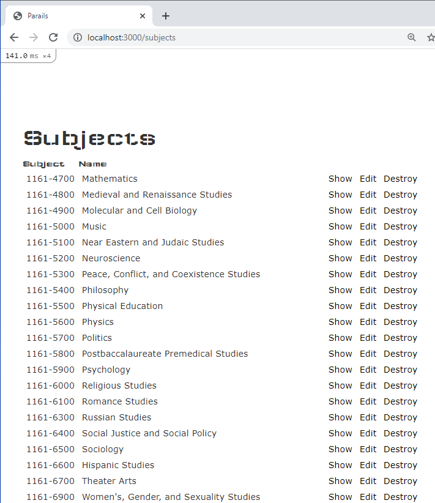

## PA Rails 1

#### Deliverables

[Heroku Project Link](https://desolate-falls-68235.herokuapp.com/)

[Github Project Link](https://github.com/jsmith2021Brandeis/PARails1) (Private)

Note on Bootstrap:

​	I changed the title font to Wallpoet,see app/assets/stylesheets/custom.scss


#### Description

​	This project imports [data on Brandeis bourses, subjects, and instructors](http://registrar-prod-rhel6.unet.brandeis.edu/export/readme.html) into a ruby on rails app that displays the information and is deployed to Heroku.

#### Views





#### Scaffolds used

`rails generate scaffold Course code:string name:string description:string requirements:string`
`rails generate scaffold Instructor instructor_id:integer email:string first:string last:string`
`rails generate scaffold Subject subject_id:string name:string`


#### PA Rails 2

Following this [authentication](https://hackernoon.com/building-a-simple-session-based-authentication-using-ruby-on-rails-9tah3y4j) tutorial (also includes CSS)

and add Enrollment from my [March 5 recitation assignemnt](https://github.com/jsmith2021Brandeis/Many-To-Many-March-5) (private link)

[form helpers](https://guides.rubyonrails.org/form_helpers.html)

possibly RORT chapter 8

Scaffolds Used

```
rails generate scaffold User name:string email:string password_digest:string

rails generate controller Sessions
```

adding entry in rails console  a=User.new(name:"A" ,email:"B", password_digest:"C") 

-Jacob Smith 

COSI 166 B Spring 2021