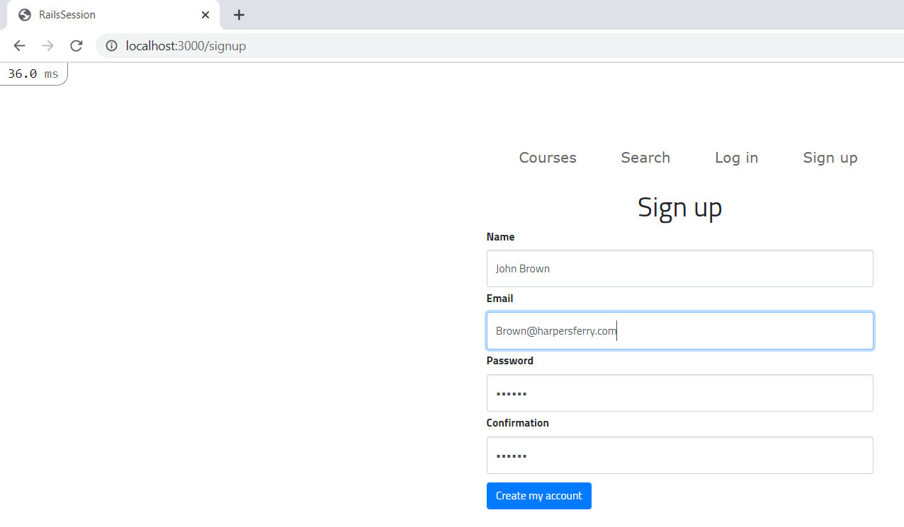

## PA Rails

#### Deliverables

[Heroku Project Link](https://desolate-falls-68235.herokuapp.com/)

[Github Project Link](https://github.com/jsmith2021Brandeis/PARails1) (Private)

#### Description

​	This project imports [data on Brandeis bourses, subjects, and instructors](http://registrar-prod-rhel6.unet.brandeis.edu/export/readme.html) into a ruby on rails app that displays the information and is deployed to Heroku.

## PA Rails 2

In this part, I added a User model, authentication, signup/login/logout, enrollments (including allowing a user to sign up for classes), and searching by keywords and subject. 

**Note on Bootstrap**

I tried to add bootstrap table and buttons, but I didn't;t get anything that works, this is what happened with the buttons in the courses view

**Views**
The user must sign up to view their profile or enroll in a class
The signup page is from the class textbook

The user's profile showing their courses

The user search for courses by a keyword and/or subject

The results from the previous search, all courses with subject mathematics and keyword "Calculus"

**Special Features**

-  I used the email and password validations from the textbook, so the email has to be a reasonable format and the password must be at least 6 characters	

-   The courses are sorted by course number, I inserted 0s into course numbers such as Anth 1a or Anth 60b, but those insertions are hidden from the user

-   I seeded the Users model with fake users and emails, each user has 3 different classes

- 

-  I flash an error message if the search returns no results or the user tries to view another user's profile

**Scaffolds Used**

`rails generate scaffold User name:string email:string password_digest:string`

`rails generate controller Sessions`

**Links Used**

authentication [1](https://hackernoon.com/building-a-simple-session-based-authentication-using-ruby-on-rails-9tah3y4j) 

and add Enrollment from my March 5 recitation assignment [1](https://github.com/jsmith2021Brandeis/Many-To-Many-March-5) (private link)

form helpers [1](https://guides.rubyonrails.org/form_helpers.html)

search page [1](https://stackoverflow.com/questions/5911794/adding-a-new-page-in-ruby-on-rails) [2](https://stackoverflow.com/questions/49485384/ruby-on-rails-how-to-implement-search-function)

## PA RAILS 1

Note on Bootstrap:

​	I changed the title font to Wallpoet,see app/assets/stylesheets/custom.scss

#### Views

#### Scaffolds used

`rails generate scaffold Course code:string name:string description:string requirements:string`
`rails generate scaffold Instructor instructor_id:integer email:string first:string last:string`
`rails generate scaffold Subject subject_id:string name:string`

-Jacob Smith 

COSI 166 B Spring 2021